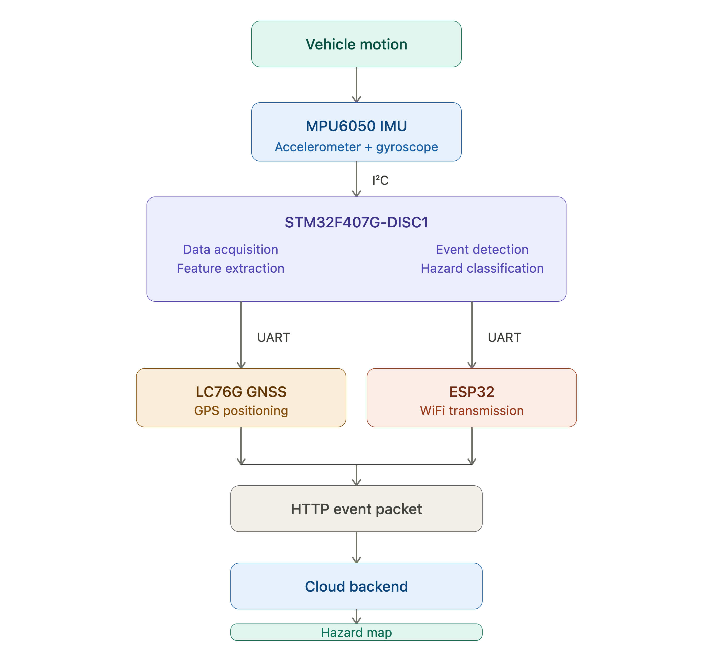

# RoadPulse

RoadPulse is an embedded IoT platform designed to detect, classify, and geolocate road hazards using inertial sensing, GNSS positioning, and wireless communication.

The project was developed to investigate a practical approach to identifying road defects such as potholes and road bumps by analyzing vehicle motion data collected during normal driving conditions. By combining real-time sensor acquisition with location tracking, RoadPulse aims to support future road-condition mapping and infrastructure monitoring initiatives.

**Status:** Active Development

---

## Problem Statement

Road deterioration and potholes present safety risks, reduce driving comfort, and increase vehicle maintenance costs. Traditional road inspections are often labor-intensive, time-consuming, and expensive.

RoadPulse explores an automated method of detecting and locating road hazards using low-cost embedded hardware mounted on a moving vehicle. The objective is to identify road anomalies and associate them with precise geographic coordinates for future visualization and analysis.

---

## System Architecture

## Hardware

* STM32 Microcontroller
* ESP32 WiFi Module
* MPU6050 Inertial Measurement Unit (IMU)
* GNSS Receiver

---

## Classification Methodology

RoadPulse analyzes vehicle motion data collected from the MPU6050 and evaluates multiple parameters including:

* Vehicle velocity
* Linear acceleration
* Roll angle
* Pitch angle
* Impact energy
* Event duration

The project currently focuses on collecting and analyzing real-world driving data to establish reliable criteria for distinguishing between:

* Potholes
* Road bumps
* Normal road conditions

Collected data is used to develop and validate classification thresholds before large-scale deployment.

---

## Engineering Contributions

* STM32 firmware development
* FreeRTOS implementation
* DMA-based sensor acquisition
* IMU integration
* GNSS integration
* Feature extraction
* Event detection framework
* ESP32 communication
* HTTP data transmission
* Embedded system integration and testing

---

## Current Status

### Completed

* STM32 firmware development
* MPU6050 integration
* GNSS integration
* ESP32 communication
* HTTP data transmission
* Real-time sensor acquisition
* Feature extraction framework

### In Progress

* Road testing and data collection
* Event characterization
* Road hazard classification model development
* Distinguishing potholes, road bumps, and normal road conditions
* Classification threshold validation
* Performance evaluation under real driving conditions

### Future Development

* Automated road hazard mapping
* Historical road condition database
* Visualization dashboard
* Large-scale deployment testing

---

## Demonstration

https://www.youtube.com/shorts/9p09gkxS2_U

---

## Technologies

* Embedded C
* FreeRTOS
* STM32
* ESP32
* MPU6050
* GNSS
* UART
* I2C
* HTTP Communication
* DMA
* Embedded Systems
* IoT
